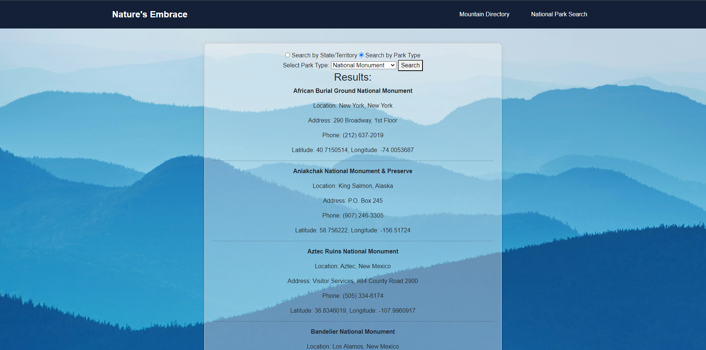

# capstone2
For capstone2 I focused on functionality first then the visuals. The homepage has a minor parallax effect, I followed FireWatchTheGame's website as an example and searched for code that was similar.

My Home Page is screencaptured below. This screencapture shows the homepage with the navbar but no text.
- 
This is an image of the homepage with the text that appears after scrolling briefly.
- 
Here is an image of the Location Search page.
- 
Lastly is an image of the mountain search page. I managed to get the images to be visible when loading the array without changing the core data in the object array.
- 
Getting the parallax effect to work properly with my homepage was quite challenging but the portion that I am most proud of is the navbar. I did not want to use a bootstrap navbar so I worked with some colleagues to create one from scratch. The code for it is listed below.

> .navbar {
    background-color: #132036;
    color: #fff;
    padding: 20px 0;
}
.container {
    display: flex;
    justify-content: space-between;
    align-items: center;
}
.logo {
    font-size: 24px;
    font-weight: bold;
    text-decoration: none;
    color: #fff;
}
.nav-links {
    list-style-type: none;
    margin: 0;
    padding: 0;
}
.nav-links li {
    display: inline;
    margin-left: 20px;
}
.nav-links li a {
    color: #fff;
    text-decoration: none;
    padding: 10px 15px;
    border: 2px solid transparent;
    border-radius: 5px;
    transition: border-color 0.3s ease;
}
.nav-links li a:hover {
    border-color: #7095fc;
}
